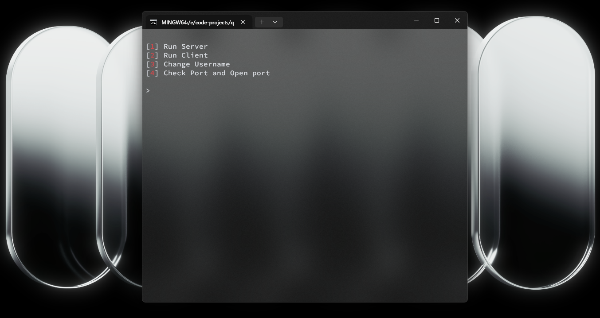

# qChat 🤫

A modular, console-based TCP messenger built entirely in Python using standard sockets. It allows real-time messaging and seamless file transfers between a server and multiple clients through a unified command system.

---

## 📸 Preview

### Main Menu


### App Icon


---

## ✨ Features

* **Multi-Client Architecture**: Server supports multiple simultaneous client connections.
* **Global Chat Room**: Messages are instantly broadcasted to all connected users.
* **File Transfer Protocol**: Send files bi-directionally (Client to Server / Server to Client).
* **Command-Driven Control**: System commands parsed via the `$` prefix.
* **Dynamic Identity**: Change your nickname on the fly during the session.
* **Modular Codebase**: Clean, decoupled architecture with 10+ specific modules.

---

## 🛠️ Command System

Messages starting with `$` are reserved for system operations and are not broadcast to the chat.

* `$sendfile` - Initiates a file transfer request.
* *(More commands can be implemented inside the modular handler).*

---

## 📁 Repository Structure

```bash
├── main.py              # Entry point (7 lines of code, launches the menu)
├── icon.png             # Application logo
├── screen.png           # Interface screenshot
└── src/
    ├── menu.py          # Main menu interface and navigation
    ├── port.py          # Port scanner and manager (defaults to 5005)
    ├── user.py          # Nickname manager and connection state definitions
    ├── packet.py        # Packet size configurations and headers
    ├── header.py        # Global imports aggregator
    ├── console.py       # Console utility wrappers (e.g., screen clearing)
    └── file/
        └── sendFile.py  # Binary file encoder and transmission logic
    └── host/
        ├── server.py    # Core server engine (tracks clients, IPs, and names)
        ├── client.py    # Core client engine (manages current session)
        ├── message.py   # Message processing and broadcasting handler
        └── var.py       # System flags and request markers (e.g., \$filerequest)
```

---

## 🚀 Getting Started

### Prerequisites
* Python 3.14 Installed

### Installation
1. Clone the repository:
   ```bash
   git clone https://github.com/qualzed/qChat
   cd qChat
   ```

2. Run the application:
   ```bash
   python main.py
   ```